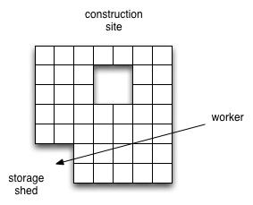

= Information Diffusion

These are my thoughts on how a game could diffuse information.

== Scenario 1

Imagine the player asked for a house to be built. The plot of land is ready to receive materials to build the house.
Further imagine a worker is carrying wood, bound a some storage shed. When the worker is "close" to the construction
site, should he deposit the goods on the construction site, or continue on his way to the storage area, where this
worker or another one will move goods back to the construction site?

Now, we can imagine this going both ways:

* The worker stops at the construction site, saves himself a trip to the storage shed, helps a fellow brother in need;
* The worker continues to the storage shed, lets global priorities determine if the house should be funded immediately
  or not.

There is also the question of how the house tells nearby workers that it wants to receive materials? I can imagine two
ways of doing this, a push and a pull model:

* The worker, while walking, shouts at the top of his virtual lungs "I'm carrying wood! Who wants my wood;"
* The house, by the sheer fact of it's construction site, makes workers go "Ahoy! A construction site with unfulfilled
  needs! Let me drop this here real quick."

The first method would be analoguous to a push method, where each worker is telling everyone "I have something to
offer", whereas the 2nd method says "I need something, feed me!", the pull method. Think a mermaid singing
and luring sailors: the house is luring construction materials to it's site. The question now becomes how to manage
multiple competing construction sites nearby.
